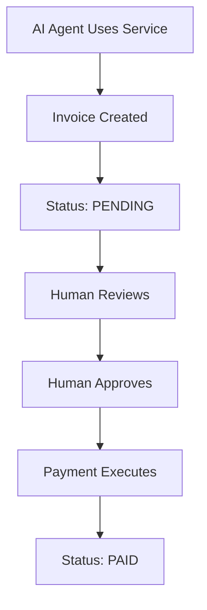
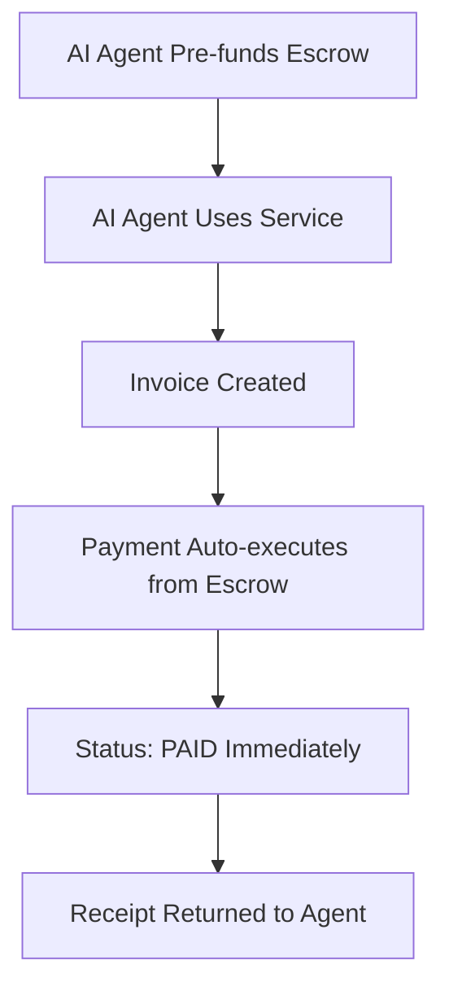

# AgentInvoice: Manual vs Autonomous Payments

## 🎯 Two Payment Modes

AgentInvoice now supports **TWO** payment modes to demonstrate the evolution from manual to autonomous payments:

---

## 📊 Comparison Table

| Feature | Manual Mode (server.js) | Autonomous Mode (server-autonomous.js) |
|---------|------------------------|----------------------------------------|
| **Port** | 3000 | 3001 |
| **Invoice Creation** | ✅ Automatic | ✅ Automatic |
| **Payment Execution** | ❌ Manual approval needed | ✅ Automatic from escrow |
| **Human Intervention** | Required | None |
| **Invoice Status** | PENDING → (wait) → PAID | PENDING → PAID (instant) |
| **Escrow Support** | No | Yes |
| **Use Case** | Traditional billing | AI agent autonomy |

---

## 🔄 Manual Payment Flow (server.js)



### API Calls:
```bash
# Step 1: Use service (creates invoice)
POST /api/services/image-generation/use
{
  "payerAddress": "0x...",
  "quantity": 2
}
# Response: Invoice created, Status: PENDING

# Step 2: Human manually approves payment
POST /api/invoices/{invoiceId}/pay
# Response: Payment initiated
```

### Problems:
- ❌ Requires human approval
- ❌ AI agent must wait
- ❌ Not truly autonomous
- ❌ Slow for high-frequency usage

---

## ⚡ Autonomous Payment Flow (server-autonomous.js)



### API Calls:
```bash
# One-time setup: Fund escrow
POST /api/escrow/ai-agent-001/fund
{
  "amount": 10.0
}
# Response: Escrow funded with 10 USDC

# Then: Use services autonomously (single call!)
POST /api/services/autonomous/image-generation/use
{
  "agentId": "ai-agent-001",
  "quantity": 2
}
# Response: 
# - Invoice created ✅
# - Payment executed ✅
# - Status: PAID ✅
# - Receipt included ✅
```

### Advantages:
- ✅ No human approval needed
- ✅ Instant payment execution
- ✅ True AI agent autonomy
- ✅ Perfect for high-frequency usage
- ✅ Pre-funded escrow = predictable costs

---

## 🎮 How to Test Both Modes

### Manual Mode (Traditional)
```bash
# Terminal 1: Start manual API
cd api
node server.js

# Terminal 2: Test manual flow
curl -X POST http://localhost:3000/api/services/image-generation/use \
  -H "Content-Type: application/json" \
  -d '{"payerAddress":"0x264d02e95d182427db11a111d7b3d256d16f3f87","quantity":2}'

# Invoice created but PENDING
# Need manual approval to pay
```

### Autonomous Mode (AI Agent)
```bash
# Terminal 1: Start autonomous API
cd api
node server-autonomous.js

# Terminal 2: Run full demo
cd api
node test-autonomous.js

# Watch the magic:
# 1. Escrow funded ✅
# 2. Service used ✅
# 3. Payment auto-executed ✅
# 4. Invoice PAID instantly ✅
```

---

## 🏆 Why This Matters for Hackathon

### Problem Statement:
"How can AI agents autonomously pay for services they consume?"

### Manual Mode Shows:
- ❌ Traditional approach doesn't work
- ❌ Human bottleneck breaks autonomy
- ❌ Not scalable for AI agents

### Autonomous Mode Shows:
- ✅ True AI agent autonomy
- ✅ Pre-funded escrow solves trust
- ✅ Instant settlements
- ✅ Complete blockchain audit trail
- ✅ Scalable for millions of micro-transactions

---

## 🎯 Demo Script for Judges

```bash
# 1. Show the problem (Manual Mode)
cd api
node server.js &
curl -X POST http://localhost:3000/api/services/image-generation/use \
  -d '{"payerAddress":"0x...","quantity":2}'

echo "See? Invoice created but PENDING. Needs manual approval ❌"

# 2. Show the solution (Autonomous Mode)
node server-autonomous.js &
node test-autonomous.js

echo "See? Invoice created AND paid automatically! ✅"
echo "This is TRUE AI agent autonomy!"
```

---

## 📊 Technical Architecture

### Manual Mode (Traditional)
```
AI Agent → API → Smart Contract → Invoice (PENDING)
                                      ↓
                              (Human approves)
                                      ↓
                            Payment Processor → PAID
```

### Autonomous Mode (Revolutionary)
```
AI Agent → Pre-fund Escrow
              ↓
AI Agent → API → Invoice + Auto-pay from Escrow → PAID
              ↓
           Receipt
```

---

## 🎓 Key Innovation: AgentEscrow Contract

The `AgentEscrow` contract enables autonomous payments by:

1. **Pre-funding**: Agents deposit USDC into their escrow
2. **Authorization**: Only authorized services can withdraw
3. **Atomic Operations**: Invoice creation + payment in single flow
4. **Audit Trail**: Every transaction recorded on-chain
5. **Gas Efficiency**: Batch operations possible

```solidity
// Simplified AgentEscrow concept
contract AgentEscrow {
    mapping(string => uint256) public balances;
    
    function deposit(string agentId, uint256 amount) external;
    function payInvoice(string agentId, bytes32 invoice, uint256 amount) external;
    function withdraw(string agentId, uint256 amount) external;
}
```

---

## 🚀 Future Enhancements

### For Autonomous Mode:
- [ ] Multi-agent escrow pools
- [ ] Automatic top-up when balance low
- [ ] Spending limits and controls
- [ ] Analytics dashboard
- [ ] Integration with major AI platforms

### For Both Modes:
- [ ] Recurring subscription billing
- [ ] Volume discounts
- [ ] Refund mechanisms
- [ ] Dispute resolution
- [ ] Multi-currency support

---

## 📝 Summary

| Aspect | Manual | Autonomous |
|--------|--------|------------|
| **Innovation Level** | Traditional | Revolutionary |
| **AI Agent Ready** | No | Yes |
| **Scalability** | Low | High |
| **Speed** | Slow | Instant |
| **User Experience** | Poor | Excellent |
| **Hackathon Impact** | Low | High |

**Winner: Autonomous Mode** 🏆

---

## 🎤 Pitch Points

1. **Problem**: AI agents can't pay for services autonomously
2. **Solution**: Pre-funded escrow with instant settlements
3. **Innovation**: First billing system designed for AI agents
4. **Impact**: Enables true AI agent economy
5. **Tech**: Built on Circle + Arc + Smart Contracts
6. **Demo**: Working prototype with 2 payment modes
7. **Future**: Platform for AI agent commerce

---

Built with ❤️ for the Agentic Commerce on Arc Hackathon
